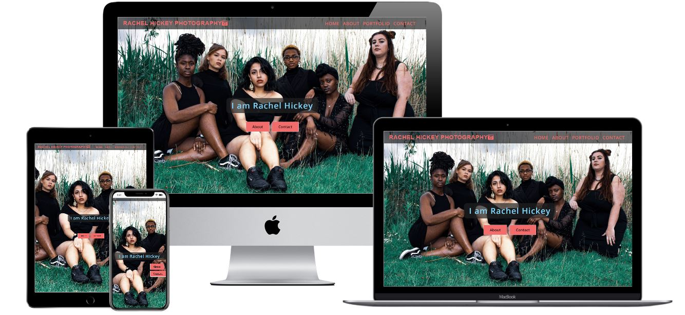
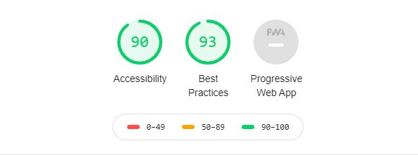

# IAmRachelHickey

This is a static scroll website created for a freelance photographer **Rachel Hickey**.
The website provides information about the photographer, examples of her work, links to her social media and a contact form.

Click [here](https://sophieh93.github.io/RachelHickeyPhotpgraphy/) to view my live website.
 
# UX 

**Target Audience** - General people who have an upcoming event, people
who like the clients work and would like to be a model, people who would like to advertise their
new business e.g new fashion brand, new music band etc.

## User Goals:
* Responsive on mobile, tablet & desktop.   
* Brief description of who the client is and her services.   
* Examples of the clients work.  
* Contact form if the user wishes to book a session.
* Socia media links if the user wishes to view morew of the clients work and follow her.
 
## User Story:

* As a user, I want to be able to view the website on different devices e.g phone, laptop etc.
* As a user, I want the site to be easy to use, with limited text to read.
* As a user, I want to be able to view the clients work clearly.
* As a user, I expect there to be a contact form that's straight forward to use.
* Aa a user, I expect there to be links to the clients socia media account.

## Design Choices

**Fonts:**  
I went with [Open Sans](https://fonts.google.com/specimen/Open+Sans) as suggested by my mentor.

**Icons:**  
I used icons from [Font Awesome](https://fontawesome.com/start) to display the **camera** on the navigation brand, the social media links **Facebook** and **Instagram** in the footer of the website and I used the **bars** to display the *burger button* on mobile devices.

**Colors:**  
My colors compliment the protfolio images on the website. 

The **primary** color of the website is **#f16c6b** -*Soft Red* which is used in the navigation for the **links** and **brand**, the background color for the **buttons**, the **selfie** border color,
the **input** section on the contact form and for the **copyright**.  
It compliments the images on the webite and makes the navigation stand out above the hero image.

The **secondary** color **#00BFFF** - *Deep Sky Blue* is used for the **hover effects** on the navigation links, text-inout on the form and for the social media icons in the footer.

*List of all the color codes:*
* #f16c6b - Soft red.
* #00BFFF - Deep sky blue
* Navigation transparent background -  rgba(0, 0, 0, 0.6).
* #0044ff - Navey blue - h2.
* 81D4FA - Heading (h1).
* #edeff1 - Solitude - About & Contact background.
* #fafafa - Snow - Submit font color.
* #ee9797 - Sea Pink - Sumbit/social media links background hover.

# Wireframes
I created my wireframes on [Wireframe.cc](https://wireframe.cc/). I created basic wireframes for desktop, tablet and mobile devices.
To view my wireframes please see my **Wireframes** folder.

# Features of the Website 
The website consistes of 4 sections-Home, About, Portfolio and Contact. When the user clicks on one of these tabs the website will scroll to that section.

The layout of the website was created using Bootstrap's grid system, HTML5 and styled by CSS.

Included a customer **scrollbar** which cna be viwed on desktops.

**Navigation:**  
Created using [Bootstrap](https://getbootstrap.com/docs/4.3/components/navs/) to make it responsive. This fixed, transparent navigation sits above the hero image.

**Home:**  
Landing page contains a fixed hero image of one of the client's work with two call to action buttons.

**About:**  
Contains an image of the client and a brief description of who the client is and what she offers. It also containes a link to the clients **Instagram** and a link to the **Contact** section of the website.

**Portfolio:**  
Created using Bootstrap grid system, Javascripts baguetteBox and lightbox gallery to display some of the clients work.

**Contact:**  
Created using the Bootstrap form to make it responsive with the following features-Name, Number, Email, Date of Event, Type of Event and Submit button.

**Footer:**  
Contains the clients social media pages, when clicked the user is brought to the clients social media page in a new tab.

# Technologies used
## Languages
* [HTML](https://developer.mozilla.org/en-US/docs/Web/HTML)
* [CSS](https://developer.mozilla.org/en-US/docs/Web/CSS)

## Frameworks
* [jQuery](https://jquery.com/)
* [Bootstrap](https://getbootstrap.com/docs/4.3/getting-started/introduction/)
* [Font Awesome](https://fontawesome.com/start)
* [Baguette Box](https://www.javascripting.com/view/baguettebox-js)

## Tools 
* [GitHub](https://github.com/)
* [GitPod](https://www.gitpod.io/)
* [Git](https://git-scm.com/about)
* [W3C Markup Validation](https://validator.w3.org/)
* [WSC CSS Validaion](https://jigsaw.w3.org/css-validator/)
* [Dirty Markup Formatter](https://www.10bestdesign.com/dirtymarkup/)

# Testing 
For this project I mainly used [Chrome DevTools](https://developers.google.com/web/tools/chrome-devtools)
to test the styling and layout and responsiveness of the website on the different devices-Mobile, Tablet and Desktop.

[W3C Markup Validaion](https://validator.w3.org/) was used to validate my HTML & CSS code. 

The website was tested on mulltiple devices such as dekstop, ipdad and multiple phone types e.g Iphone, Huawei and Samsung.

### **Navigation:**  
I tested that the navigation links worked and brought the user to the correct section of the website.
I added Media Queries to ensure the navigation would display properly on all devices. For smaller devices 
the navigation would be replaced with a drop-down menue.

### **Contact Form:**  
If the user does not fill in their **number** an error message will appear.

If the user does not fill in their **number** an error message will appear.

If the user does not fill in a valid **email** address, an error message will appear advising the user to include an *@*.

If the user clicks **submit** without submitting any data, an error message should appear that hightligts the required fields to be filled out.

I added this form validation by including the html5 attribute **required**.

### **Footer:**  
If the user clicks on the social media link, it will open the clients social media account in a new tab.

    

I used the lighthouse testing to test the performance on mobile and desktops.  
**Mobile & Desktop**-same result:   

# Bugs
During this project the main bugs I encountered was with the navigation. See below for a detailed explanation.
### **Navigation Bugs:**
1. **Bug 1:**   
     *  As I wanted to have the navigation bar to be fixed on top of the **hero** image the first bug I encountered
     was finding a background color for the Navigation that also complimented the hero image. I did not like the solid background colors as I felt that
     this was too harsh on top of the hero image.   

    **The Fix:**
    * I decieded to use a transparent background using rgba(0, 0, 0, 0.6) code. This does not cover any of the hero image.       

2. **Bug 2:**   
     * As I decided to go with the transparent background for the navigation this then caused difficulty finding the color
     to use for the navigation links. The traditional colors such as black and white blended into the hero image so these were not suitable.  
    As most of the images on the website consists of the colours pink, green, blue and purple I started playing with these colors for the navigation links on [color picker](https://htmlcolorcodes.com/color-picker/).

    **The Fix:**
    * I settled for the colors **#f16c6b** for the nav links and nav brand and the color **#00BFFF** for the hover effect as I felt these stood out onto of the hero image best.

3. **Bug 3:**   
     * The navigation toggle button was too large on phones and small devices as it covered too much of the hero image.  

    **The Fix:**
    * I replaced the toggle icon with the [Font Awesome](https://fontawesome.com/icons?d=gallery&q=bar) *bars* icon.

# Deployment

I deployed the websit using **GitHub's pages**. The steps are as follows:   

1. Open **GitHub** in the browser.
2. Sign into my account.
3. Select my **repositories**.
4. Navigate to *RachelHickeyPhotpgraphy*.
2. On the top right select **settings**.
3. Scroll down to the **GitHub Pages** area.
4. From the **Source** dropdown menu click on **Master Branch**.
5. Refresh the page and scroll back down to the **GitHub Pages** area to view the link to your live website.

### Running the website Locally:
To clone **Rachel Hickey Photography** from GitHub:

1. Navigate to **SophieH93/RachelHickeyPhotpgraphy**.
2. Click the green **Clone or Download** button.
3. **Copy** the **url** in the dropdown box.
4. Using your favourite **IDE** open up your preferred **terminal**.
5. **Navigate** to your desired file location.
6. **Copy** the following code and **input** it into your terminal to clone Rachel Hickey Photography.

# Credits
* All images used in this site were provided by my client **Rachel Hickey**.  
* The Gallery was created follow **Webseotips** [Youtube](https://www.youtube.com/watch?v=k-RtYiiB47E&amp=&t=151s) video.
* Scrollbar created by **Online Turtorials** [Youtube](https://www.youtube.com/watch?v=mijLmCD3W9s) video.
* **Simen Daehlin** my mentor.

**This websit is for educational purposes only.**