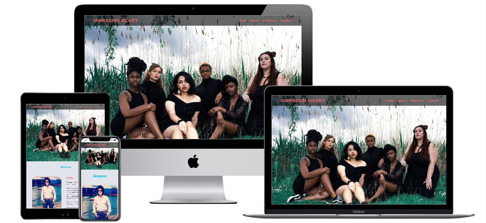

# IAmRachelHickey

This is a static scroll website created for a freelance photographer Rachel Hickey.
The website provides information about the photographer, examples of her work, links to her social media and a contact form.

Live website https://sophieh93.github.io/RachelHickeyPhotpgraphy/

 
# UX 

**Target Audience** - General people who have an upcoming event, people
who like the clients work and would like to be a model, people who would like to advertise thier
new business e.g new fashion brand, new music band etc.

## User Goals:
* Responsive on mobile, tabley & desktop.   
* Brief description of who the client is & her services.   
* Gallery examples of the service.  
* Contact form if the user wished to book a session.
* Socia media links to if the user wished to view morew of the clients work and follow her.
 
## User Story:

* As a user, I want to be able to view the website on different devices e.g phone, laptop etc.
* As a user, I want the site to be easy to use, with limited text to read.
* As a user, I want to be able to view the clients work clearly.
* As a user, I expect there to be a contact form that's straight forward to use.
* Aa a user, I expect there to be links to the clients socia media account.

## Design Choices

**Fonts:**

**Icons:**  
I used icons from [Font Awesome](https://fontawesome.com/start) for the social media links in the footer of the website.

**Colors:**  
My colors compliment the protfolio images on the website. 

The **primary** color of the website is #f16c6b -'Soft Red' which is used in the navigation and copyright.
It compliments the images on the webite and makes the navigation stand out above the hero image.

The **secondary** color #00BFFF - 'Deep Sky Blue' is used as the header color for the different sections on the website,
hover over on the navigation links and for the social media icons in the footer.

*List of all the color codes:*
* #f16c6b - Soft red.
* #00BFFF - Deep sky blue
* Navigation transparent background -  rgba(0, 0, 0, 0.6)!important.
* #e1e5eb - Solitude.
* #f0f3f5 - Alice blue

# Wireframes
I created my wireframes on [Wireframe.cc](https://wireframe.cc/). I created basic wireframes for desktop, tablet and mobile devices.
To view my wireframes please see my 'Wireframes' folder.

# Features of the Website 
The website consistes of 4 sections-Home, About, Portfolio and Contact. These are all fixed to the Navigation on the right side. When the user clicks on one of these tabs the website will scroll to that section.

The layout of the website was created using Bootstrap's grid system and styled by CSS.

**Navigation:**  
Created using Bootstrap to make it responsive. This fixed Navigationis transparent and sits ontop of the hero image.

**Home:**  
Landing page contains a hero image of one of the client's work.

**About:**  
Contains an image of the client and a brief description of who the client is and what she offers.

**Portfolio:**  
Created using Bootstrap grid system and lightbox gallery to display some of the clients work.

**Contact:**  
Created using the Bootstrap form to make it responsive with the following features-Name, Number, Email, Date of Event, Type of Event and Submit button.

**Footer:**  
Contains the clients social media pages, when clicked the user is brought to the clients social media page in a new tab.

# Technologies used

* [GitHub](https://github.com/)
* [GitPod](https://www.gitpod.io/)
* [Git](https://git-scm.com/about)
* [HTML](https://developer.mozilla.org/en-US/docs/Web/HTML)
* [CSS](https://developer.mozilla.org/en-US/docs/Web/CSS)
* [jQuery](https://jquery.com/)
* [Bootstrap](https://getbootstrap.com/docs/4.3/getting-started/introduction/)
* [W3C Markup Validation](https://validator.w3.org/)
* [WSC CSS Validaion](https://jigsaw.w3.org/css-validator/)
* [Font Awesome](https://fontawesome.com/start)
* [Baguette Box](https://www.javascripting.com/view/baguettebox-js)

# Testing 

W3C Markup Validaion - Used to validate HTML & CSS code.  

Google Chrome developer - Used to check that my website was responsive on all devices.

<strong>Contact Form</strong>:
If the user clicks 'submit' without submitting any data an error message should appear that hightligts the required field to be filled.

If the user does not fill in a valid email address, an error message will appear.

If the user does not fill in the 'Name' or 'Event Type', an error message will appear.

<strong>Footer:</strong> 
Ensured that when the user clicks on the social media link that the link works and will open the social media
page in a new tab to the clients account.

# Bugs
1. **Bug** - Getting the font color/background color for the navigation so it was visible above the hero image. Most font colors faded into the hero image.
* **Fix** - color code #f16c6b and #00BFFF works best for the navigation with a transparent backgrounf.

2. **Bug**-The navigation toggle button was too large on phones and small devices-It covered too much of the hero image.  
* **Fix**-Added the Font Awesome 'bars' icon.

# Deployment
I deployed the websit using GitHub's pages. The steps are as follows:   
1. Open my project repository on GitHub.
2. On the top right select **settings**.
3. Scroll down to **GitHub Pages**.
4. From the **source** dropdown menu click on **Master Branch**.
5. Website now live.

# Credits
All images use in this site belong to Rachel.
